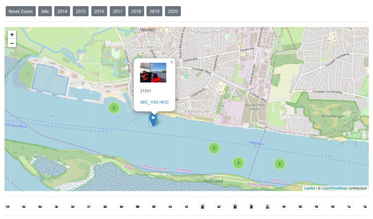

# photo_gps_map
Simple but fun scripts to create a GPS based map of your fotos with Leaflet and OpenStreetMap

## Overview

This little tool consists of very few scripts. It requires quite a bit of other software (Perl, ImageMagick, MySQL etc.) but once running it's simple but fun.

**1 import_fotos.pl**
A Perl import script is used to scan the given image folders, write EXIF-Metadata to the database and create preview images. 

**2 Gallery**
A jQuery/Leaflet HTML page and a list of PHP-scripts to create the map with all images that have a GPS tag.  If you click on an image a gallery is created that shows all pictures taken +/- 1,5 hours around this picture so you can also see pictures 
that were taken closely but have no GPS tag.

## Requirements

I run this on a Windows PC but it should also run on any Unix system. For Windows you need:
* Webserver + MySQL DB (e.g. XAMPP)
* ImageMagick to generate the thumbs. I had to compile the newest version myself because libHeif is not yet activated in the precompiled version. You need this plugin if you want to read the new HEIC-format which is the new standard on Apple iPhones. (Make sure to check "Keep originals" on the iPhone settings. Downloading the original HEIC files is much more stable and efficient).
* Strawberry Perl (The Perl version of XAMPP has not the necessary modules for EXIF etc.)

## Installation / Start

* Set up the database using the given SQL script and add a user. 
* Make the Website directory accessible by the Webserver
* Enter the DB credentials in Config/fotos.cfg
* Check the other parameters in Config/fotos.cfg
* Go to the main folder and enter "perl Import\import_fotos.pl Config\fotos.cfg" (or with / on Unix). The import should start
* Once the import is finished, open the browser and navigate to the website directory
* Have fun!

## More examples

